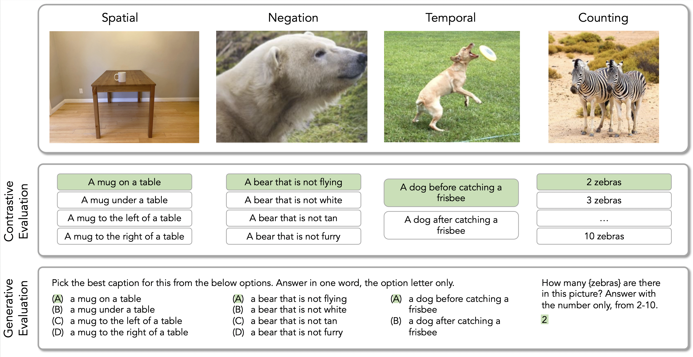

# Scale Can’t Overcome Pragmatics: The Impact of Reporting Bias on Vision-Language Reasoning (TACL 2026)

Code and data for "Scale Can’t Overcome Pragmatics: The Impact of Reporting Bias on Vision-Language Reasoning".

More detailed instructions to follow! 

# Evaluation data
Each dataset is in a separate JSON file under `data/benchmarks`. The JSON files consist of the filepath to the image, the list of caption options, and the index into that list of the correct option. The images are present under `data` as well.

# Evaluation code
The code to evaluate different models on different datasets is present under `eval`. The MCQ-formatted tasks (spatial, negation, temporal) are separate from the open-ended task (counting). 

# Finetuning data
The code with which LLAVA-1.5 was finetuned is present under `data/finetuning_data.json`, already in the format required for LLAVA finetuning.
